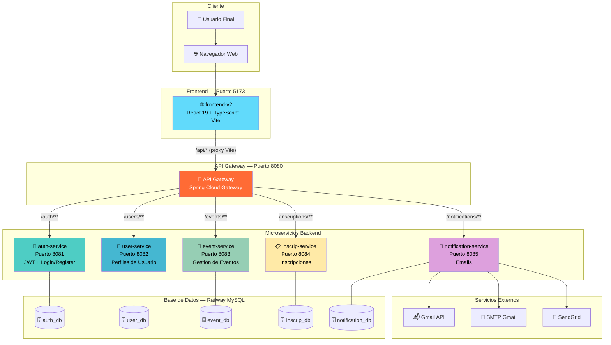
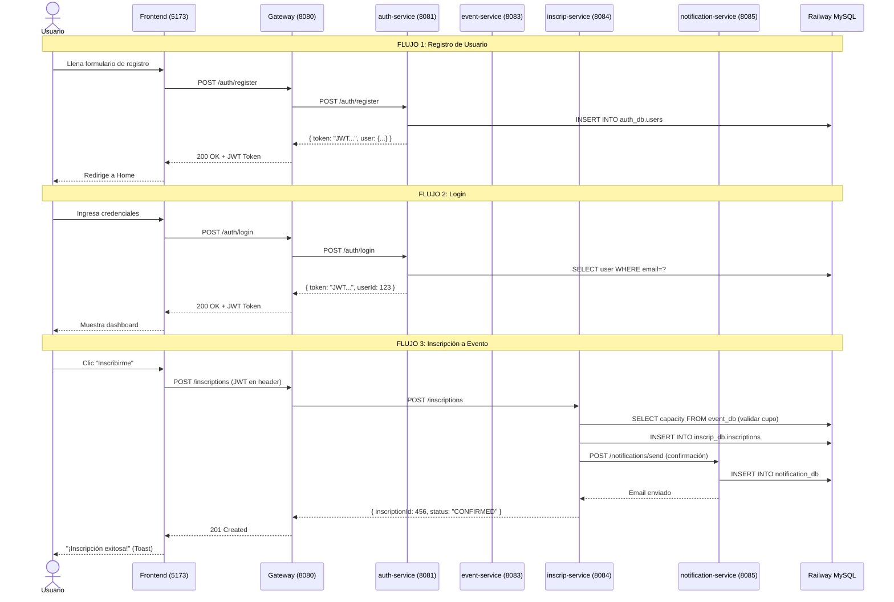
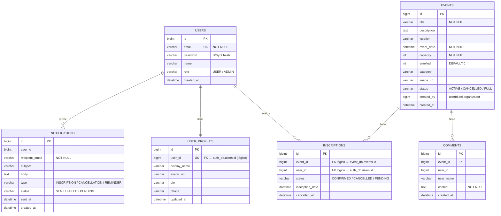
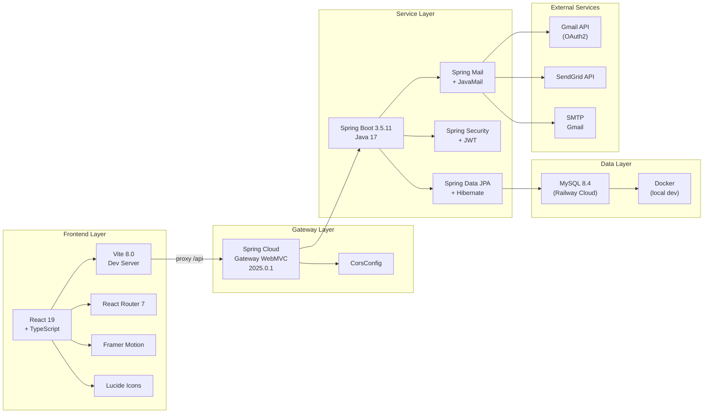
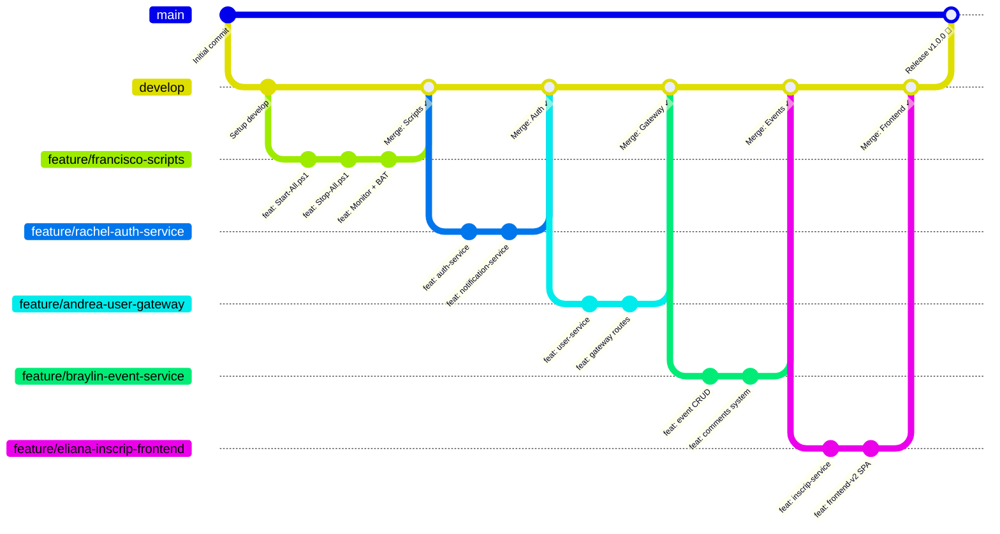
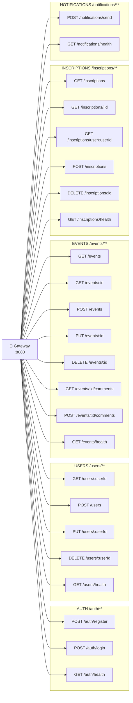
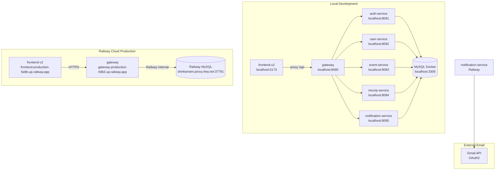
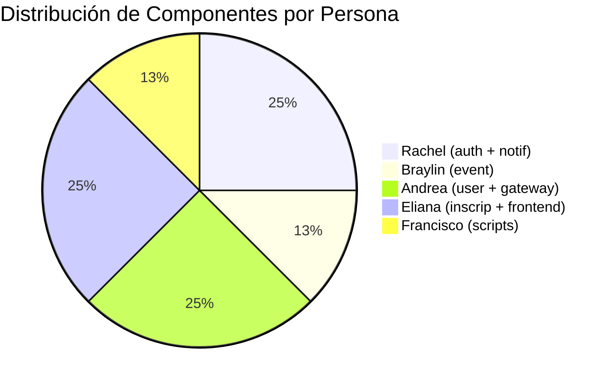

# 📊 DIAGRAMAS DE ARQUITECTURA — EVENTOS MICROSERVICIOS

> Documentación técnica completa: diagramas de sistema, base de datos, flujos y Git.

---

## 1. ARQUITECTURA GENERAL DEL SISTEMA



---

## 2. DIAGRAMA DE FLUJO — REGISTRO E INSCRIPCIÓN



---

## 3. DIAGRAMA ENTIDAD-RELACIÓN (BASE DE DATOS)



---

## 4. DIAGRAMA DE COMPONENTES — TECNOLOGÍA



---

## 5. FLUJO DE TRABAJO GIT



---

## 6. DIAGRAMA DE ESTADOS — INSCRIPCIÓN

```mermaid
stateDiagram-v2
    [*] --> Disponible : Evento creado

    Disponible --> Inscrito : Usuario se inscribe\n(POST /inscriptions)
    Disponible --> Lleno : capacity == enrolled

    Lleno --> Disponible : Alguien cancela\n(enrolled decreases)

    Inscrito --> Cancelado : Usuario cancela\n(DELETE /inscriptions/{id})
    Cancelado --> Inscrito : Usuario re-inscribe
    Cancelado --> [*] : Evento finaliza

    Inscrito --> Confirmado : Email enviado\n(notification-service)
    Confirmado --> [*] : Evento finaliza

    state "Inscrito" {
        [*] --> Pendiente
        Pendiente --> EmailEnviado : Notificación OK
        Pendiente --> ErrorEmail : Falla de email
        ErrorEmail --> EmailEnviado : Reintento exitoso
    }
```

---

## 7. MAPA DE ENDPOINTS — API COMPLETA



---

## 8. INFRAESTRUCTURA DE DESPLIEGUE



---

## 9. RESUMEN DE RESPONSABILIDADES



---

*Documentación técnica generada: 2026-03-13 | Proyecto: Eventos-Microservicios*
